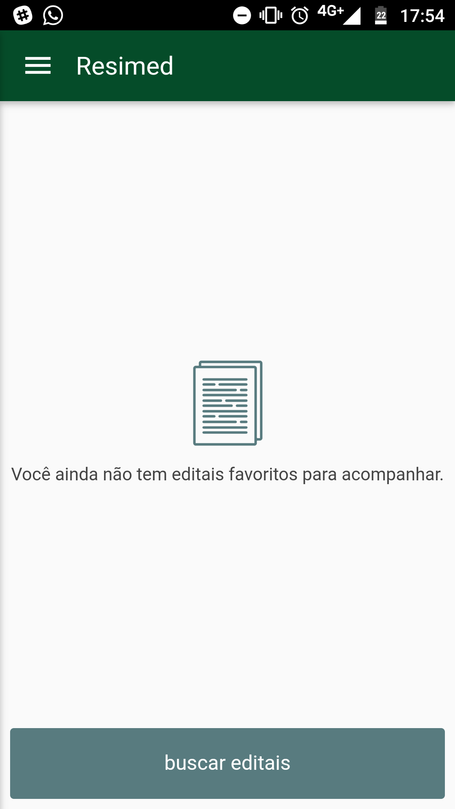

# Resimed
Aplicativo para localizar e acompanhar residências médicas.

## Interface

  
  

  
  

## Tecnologia
Foi desenvolvido usando a ferramenta *Córdova*

### Desenvolvedores
* João Carlos Pandolfi Santan
* Vinícius Bispo Neves